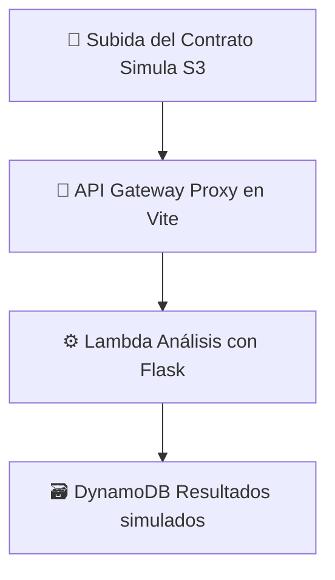

# AWS Contract Analyzer

Una demo profesional de arquitectura serverless simulada, creada con **Vite + React + TailwindCSS + ReactFlow**. Demo on-line: https://3mmanu3lmois3s.github.io/aws-contract-analyzer/

---

## 🚀 Objetivo

Simular un flujo de procesamiento de contratos PDF en una arquitectura estilo **AWS Serverless**, donde el frontend se ejecuta en GitHub Pages y el backend en una API Flask local. El objetivo es demostrar un flujo completo de análisis de contratos, destacando el uso de componentes que imitan servicios como S3, API Gateway, Lambda y DynamoDB.

---

## 🧱 Arquitectura de la demo



El frontend también muestra este flujo mediante un diagrama interactivo con `ReactFlow`.

---

## ⚙️ Requisitos previos

- Node.js ≥ 18
- Python ≥ 3.10
- Git
- Acceso a terminal bash compatible (`Git Bash`, `WSL`, `Linux`, etc.)

---

## 🧰 Tecnologías utilizadas

| Herramienta    | Rol en la demo                  |
| -------------- | ------------------------------- |
| Vite           | Bundler para frontend React     |
| React          | Framework de UI                 |
| Tailwind CSS   | Estilos modernos y responsivos  |
| ReactFlow      | Visualización del flujo AWS     |
| Axios          | Comunicación HTTP con Flask     |
| Flask (Python) | Simulación de Lambda/API        |
| gh-pages       | Despliegue a GitHub Pages       |

---

## Prueba rapida de la demo

🖥️ Descargar Ejecutable del backend
➡️ [Descargar contract-api.exe (Windows)](https://github.com/3mmanu3lmois3s/aws-contract-analyzer/releases/download/v3.0/contract-api.exe)

📄 Ejecutalo, incluye todo lo necesario para ejecutar el backend Flask local sin instalar nada.
🖥️ Entrar a la githubpages de la demo ( https://3mmanu3lmois3s.github.io/aws-contract-analyzer/ ) y prueba a subir los contratos PDF de ejemplo que estan en el repositorio github del proyecto.

---

## 📦 Instalación rápida

```bash
git clone https://github.com/3mmanu3lmois3s/aws-contract-analyzer.git
cd aws-contract-analyzer
chmod +x setup.sh
./setup.sh
npm run dev  # o npm run deploy para publicar
```

> ℹ️ Todo se genera automáticamente: estructura, configuración, dependencias y archivos base.

---

## 🌐 Despliegue en GitHub Pages

El `setup.sh` incluye:
- Configuración `vite.config.js` con proxy
- Scripts de `predeploy` y `deploy` en `package.json`
- Instalación de `gh-pages`

Despliegue:
```bash
npm run deploy
```

Sitio accesible en:
```
https://3mmanu3lmois3s.github.io/aws-contract-analyzer
```

---

## 🔁 Backend Flask local

La API de análisis corre localmente. Es fundamental ejecutarla en tu máquina:

```bash
python api.py
```


🛠️ Instrucciones para Ejecutar el Backend
Para que la demo funcione correctamente, es necesario ejecutar el backend Flask localmente.​

1. Clona el repositorio
```bash
git clone https://github.com/3mmanu3lmois3s/aws-contract-analyzer.git
cd aws-contract-analyzer
```
2. Crea y activa un entorno virtual
```bash
python -m venv venv
```
# En Windows
venv\Scripts\activate
# En macOS/Linux
source venv/bin/activate

3. Instala las dependencias
```bash
pip install -r requirements.txt
```
4. Ejecuta la API
```bash
python api.py
```
La API estará disponible en http://localhost:5000.​

## 🔁 Tolerancia a Fallos
La demo incluye mecanismos de tolerancia a fallos para mejorar la experiencia del usuario:​

Indicadores de estado del servidor: Muestran si el backend está activo o inactivo.​

Mensajes de error amigables: Informan al usuario si el backend no está disponible.​

Esto simula el comportamiento de un backend AWS Lambda. El frontend usará esta API si detecta que está en localhost.

---

## ✅ Estado actual

- [x] Frontend React funcional
- [x] Diagrama AWS con React Flow
- [x] Tailwind + Axios + Proxy configurado
- [x] Setup automatizado con `setup.sh`
- [x] Preparado para GitHub Pages
- [x] API Flask de prueba local funcional

---

## 👤 Autor

**Emmanuel Moisés Mellado Martínez**  
[GitHub](https://github.com/3mmanu3lmois3s)

---

## 📄 Licencia

MIT © 2025 - Emmanuel Moisés Mellado Martínez
